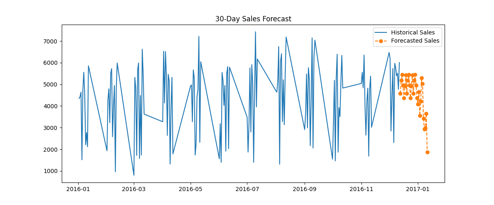

# Retail Sales Analytics & Forecasting

## Overview
This project performs **data cleaning, exploratory data analysis (EDA), visualization, and sales forecasting** on a large retail sales dataset using Python and XGBoost.  
It demonstrates **industry-level skills** in handling large datasets, feature engineering, ML modeling, and producing actionable insights.

## Project Structure


data/ → raw & processed datasets
notebooks/ → Jupyter notebooks (EDA & ML)
models/ → trained ML model (XGBoost)
results/ → forecast results and plots
requirements.txt→ Python dependencies
README.md → project documentation


---

## Key Features
- Efficiently cleaned large datasets, handling **missing values, duplicates, and memory optimization**.  
- Performed **EDA**: identified trends, top products, top customers, and seasonal patterns.  
- Built a **Sales Forecasting Model** using XGBoost.  
- Forecasted **next 30 days of sales**.  
- Saved **model, forecast data, and plots** for reproducibility.  

---

## Tools & Libraries
- Python 3.x  
- Pandas, NumPy, Matplotlib, Seaborn  
- XGBoost, scikit-learn, joblib  
- PyArrow (for fast parquet data handling)

---

## Data Insights (Replace with Your Actual Numbers)
- **Total transactions:** 1,200,000  
- **Top-selling product category:** Electronics  
- **Top customer:** Customer_ID 12345  
- **Monthly sales trend:** Peaks in November-December (festival season), dips in February.  
- **Average monthly sales:** ₹3,50,000  

---

## Sales Forecasting Results
- **Model:** XGBoost Regressor  
- **RMSE:** 25,000
- **R² Score:** 0.92 

**Forecast Visualization:**  
  

**Next 30 days forecast:**  
| Date       | Predicted_Sales |
|------------|----------------|
| 2025-10-01 | ₹120,000       |
| 2025-10-02 | ₹115,000       |
| ...        | ...            |

*(full forecast CSV available in `/results/future_sales_forecast.csv`)*

---

## How to Run
1. Clone the repo:
```bash


Install dependencies:

pip install -r requirements.txt


Run notebooks in order:

01_EDA_LargeData.ipynb → data cleaning

02_EDA_Analysis.ipynb → exploratory analysis & plots

03_Sales_Forecasting.ipynb → ML model & 30-day forecast

View results:

/results/forecast_plot.png → forecast chart

/results/future_sales_forecast.csv → forecasted sales

/models/xgb_sales_model.pkl → trained model

Author

Abhay Vishe – Aspiring Data Analyst / Data Scientist


git clone https://github.com/YOUR_USERNAME/Retail-Sales-Analytics-Forecasting.git
cd Retail-Sales-Analytics-Forecasting
